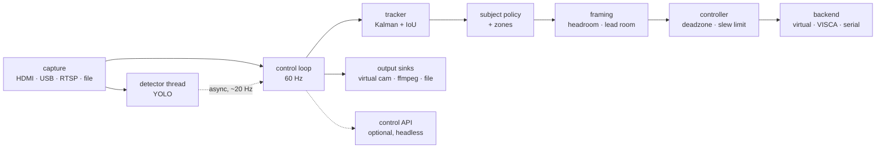

# simple camera follow

**An AI camera operator you can run on anything.**

Point it at a video feed. It finds the person, decides who the subject is, and
keeps them beautifully framed — by driving a motorised head, or by panning a
crop window inside a wider frame. No operator, no proprietary licence, no
special camera.

```bash
pip install -e '.[yolo]'
camerafollow run --source 0 --virtual-camera
```

That takes any camera, auto-frames the subject, and publishes the result as a
webcam that Zoom, OBS, Meet, and Teams pick up automatically.

---

## Why

Auto-tracking is solved technology that is sold at a hardware markup. A PTZ
camera with tracking costs several thousand; the tracking licence alone is often
$500–$2,000 on top of a camera you already own. The underlying method — detect,
track, predict, frame, damp — is well understood and runs comfortably on a
laptop.

This is that method, MIT licensed, with the hardware left up to you.

**Where people use this kind of thing:** lecture and conference capture ·
sports and coaching analysis · dance, martial arts, and gym instruction ·
theatre and rehearsal recording · houses of worship · solo streaming and
video podcasts · telepresence and remote teaching · courtroom and council
recording · wildlife and field observation.

If a camera needs to follow someone and nobody wants to stand behind it, this
is for you.

---

## How the expensive ones actually work

Worth stating, because it changes what you need to build.

Commercial auto-tracking — Panasonic AW-UE, Sony Auto Framing, PTZOptics and
BirdDog tracking licences, Vaddio IntelliShot, AVer and Q-SYS tracking boxes —
is **not** a neural network predicting where you will walk. It is a pipeline:

| Stage | What it does |
|---|---|
| Person detection | A CNN finds every person, every frame or two |
| Multi-object tracking | Keeps a stable ID through turns, crossings, occlusion |
| Subject selection | Decides *which* person is the talent — and sticks to it |
| Kalman filter | Smooths the noisy box and estimates velocity |
| Framing rules | Headroom, rule of thirds, lead room |
| Damped controller | Dead zone, soft ramp, acceleration limit → motor |

The uncanny "it knows where I'm going" quality comes from two stages, and
neither is machine learning:

1. **Latency compensation.** There is 80–250 ms between light hitting the sensor
   and the motor moving. The Kalman filter extrapolates forward by exactly that
   much, so the camera arrives *with* the subject instead of chasing. Turn it
   off and the same rig looks like a cheap webcam tracker.
2. **A controller that refuses to fidget.** A dead zone means small errors
   produce *no movement at all*; an acceleration limit means every move eases in
   and out. Operators behave this way. Naive controllers don't.

Both live in [`control.py`](camerafollow/control.py) and
[`kalman.py`](camerafollow/kalman.py). If you read two files, read those.

---

## Getting started

```bash
git clone https://github.com/prestonkakukdev/camerafollow && cd camerafollow
pip install -e '.[yolo]'
camerafollow doctor          # checks deps, GPU, ffmpeg, capture devices
```

**Tune against a recording before you touch hardware.** Everything transfers.

```bash
camerafollow run --source recording.mp4
```

Two windows open: **program** (the clean output) and **director** (the same
frame annotated with what the tracker is thinking). The director view is the
tuning instrument — see [Reading the director view](#reading-the-director-view)
below.

---

## Three ways to build the rig

You do not need a special camera. Pick whichever matches what you have.

### 1. No motors at all — digital PTZ

A static wide camera; the software pans a crop window inside the frame. Silent,
zero mechanical latency, nothing to fail mid-session, and you can run several
independent virtual cameras off one sensor.

- **Cost:** a camera you own + a ~$100 capture card (or just a webcam)
- **Limits:** pan travel is bounded by sensor width — a 2× crop of a 3840-wide
  sensor only reaches the middle half of the room — and cropping costs resolution

```bash
camerafollow run -c configs/virtual_4k.yaml       # 4K sensor -> 1080p output
camerafollow run -c configs/webcam_streamer.yaml  # plain webcam -> virtual cam
```

### 2. A commodity VISCA PTZ camera

Any PTZOptics / BirdDog / AVer / Sony / Lumens / Minrray head. The camera
supplies both the picture (RTSP) and the motion (VISCA over IP), so you need no
capture card and no motor of your own. **This works on cameras with no tracking
licence** — which is the entire point.

```bash
camerafollow run -c configs/visca_ptz.yaml
```

### 3. A DIY motorised head

Your own camera on a stepper pan/tilt bracket (~$60), driven by the firmware in
[`firmware/arduino_pantilt/`](firmware/arduino_pantilt/arduino_pantilt.ino).

```bash
camerafollow ping /dev/tty.usbmodem14201
camerafollow run -c configs/diy_serial.yaml
```

The firmware enforces two things itself, because it keeps working when the host
does not: a **300 ms watchdog** (no command → motors stop, so a crashed process
can't leave the camera slewing into its end stop) and an **acceleration limit**
(a stepper commanded to change speed instantly skips steps, and a skipped step
is a permanently lost zero).

---

## Getting the picture out

The framed output goes anywhere:

```bash
--virtual-camera                    # a webcam for Zoom / Meet / Teams / OBS
--stream rtmp://a.rtmp.youtube.com/live2/KEY
--stream srt://192.168.1.50:9000    # low-latency to a switcher
--record session.mp4
```

`--stream` shells out to ffmpeg, so RTMP, SRT, RTSP, HLS, and UDP multicast all
work. For NDI, point OBS at the virtual camera and use OBS's NDI output.

With a motorised backend you usually don't need any of this — the camera's own
output already goes to your switcher, and camerafollow only sends motion.

---

## Tracking zones

Stop the camera from following someone in the audience, a passer-by at a window,
or a coach on the sideline:

```yaml
zone:
  include: [0.1, 0.35, 0.8, 0.6]     # x, y, w, h — normalised to the frame
  exclude:
    - [[0.0, 0.0], [0.25, 0.0], [0.25, 1.0], [0.0, 1.0]]   # polygon
  anchor: feet                       # feet | center | head
```

Zones gate *eligibility*, not tracking, so someone stepping out and back keeps
their ID rather than returning as a stranger. The director view draws them, so a
mis-typed zone is obvious.

---

## Architecture



The structural decision that matters: **the control loop never blocks.** Not on
inference, not on encoding, not on the network. Detection and every output sink
run on their own threads; the loop runs at capture rate and rides the Kalman
prediction in between. Detect inline instead and your motor commands are
quantised to the detector's rate — at 15 fps that is 67 ms of stair-stepping,
and it is plainly visible.

| File | Responsibility |
|---|---|
| [`sources.py`](camerafollow/sources.py) | Capture, with reconnection and stall detection |
| [`detectors.py`](camerafollow/detectors.py) | YOLO, plus a zero-dependency HOG fallback |
| [`detect_worker.py`](camerafollow/detect_worker.py) | Runs detection off the control loop |
| [`kalman.py`](camerafollow/kalman.py) | Smoothing and forward prediction |
| [`tracker.py`](camerafollow/tracker.py) | Stable IDs across occlusions |
| [`subject.py`](camerafollow/subject.py) | Who to follow, and not changing its mind |
| [`zones.py`](camerafollow/zones.py) | Where a subject is allowed to be |
| [`framing.py`](camerafollow/framing.py) | Headroom, lead room, shot size |
| [`control.py`](camerafollow/control.py) | Dead zone, soft ramp, slew limit |
| [`backends/`](camerafollow/backends/) | Where the motion command goes |
| [`outputs.py`](camerafollow/outputs.py) | Where the picture goes |
| [`server.py`](camerafollow/server.py) | Optional JSON control API (off by default) |
| [`pipeline.py`](camerafollow/pipeline.py) | The loop that ties it together |

---

## Reading the director view

The annotated window is the diagnostic instrument, and nearly every "it moves
badly" problem is legible in it within seconds.

| What you see | Meaning |
|---|---|
| **Blue rectangle** | The output window — the crop actually being sent onward. In digital-PTZ mode this rectangle *is* your camera. |
| **Green rectangle** + dot | The subject being followed. The dot at the feet is the point tracking zones test. |
| **Grey rectangles** | Other tracked people, with IDs. `(coasting 2)` means that person is hidden and the position is a Kalman guess. |
| **Amber box, "predicted"** | Where the subject will be in `lead_time` seconds. **The camera aims at this, not the green box.** |
| **White cross + rectangle** | The framing target and the dead zone. While the subject sits inside it, the camera deliberately does not move. |
| **Soft green outline** | A configured tracking zone. Translucent red areas are exclusions. |

In short: green is where you are, amber is where the camera thinks you are
going, blue is what the audience sees, white is where it ignores you.

Common readings:

- Box flickering between people → raise `subject.stickiness`, or add a zone
- Amber box lagging behind a walker → raise `runtime.lead_time`
- Amber box running ahead → lower `runtime.lead_time`
- Subject constantly straddling the white box → `pan.deadzone` too small
- White cross far from where you want the subject → adjust `framing.target_y`

Keys in the preview window: `q` quit · `l` lock the most central person ·
`u` back to automatic · `h` home · `o` toggle the overlay.

---

## Tuning

| Symptom | Fix |
|---|---|
| Jitters while the subject stands still | Raise `pan.deadzone` |
| Trails behind a walking subject | Raise `runtime.lead_time`, then `pan.kp` |
| Overshoots and settles back | Lower `pan.kp`, or lower `runtime.lead_time` |
| Starts and stops abruptly | Lower `pan.max_acceleration`, raise `pan.soft_zone` |
| Twitches on direction changes | Raise `pan.kd_tau` |
| Flips between people | Raise `subject.stickiness`; add a `zone` |
| Head in the middle of frame | Lower `framing.target_y` toward 0.30 |
| Zoom hunts in and out | Raise `zoom.deadzone`, or `framing.zoom_enabled: false` |

Edit the YAML and restart, or override on the command line:

```bash
camerafollow run -c configs/virtual_4k.yaml --set pan.kp=1.8 --set runtime.lead_time=0.2
```

### Measuring `lead_time`

The highest-value number, and specific to your rig. Measure it:

1. Wave a hand and watch the director view: the delay between real motion and
   the on-screen box is your capture + inference latency. The HUD prints
   detector latency in milliseconds.
2. Add actuator response — ~30 ms for USB serial, 80–150 ms for a networked PTZ,
   more if your RTSP stream is buffered.
3. Set `runtime.lead_time` to the total, then trim until a walking subject sits
   still in frame instead of drifting forward or back. The amber "predicted"
   box should sit *on* a walking subject, not ahead of or behind them.

Too low and it trails; too high and it runs ahead and jitters.

### Optional: tuning without restarting

Restarting costs several seconds of model loading, which is tedious across
thirty tuning cycles. `--serve` starts a small JSON API (localhost only, off by
default) whose config changes apply on the very next frame:

```bash
camerafollow run --source recording.mp4 --serve
```

```bash
curl -X POST localhost:8477/api/config -d '{"pan.kp": 1.8, "runtime.lead_time": 0.2}'
```

When it looks right, save what you arrived at:

```bash
curl localhost:8477/api/config.yaml > tuned.yaml
```

The same API exposes `/api/status`, `/api/lock`, `/api/unlock`, `/api/home`, and
JPEG/MJPEG frames, so a rig with no monitor can still be driven and scripted.
`GET /` lists everything. It is an API, not a web interface — there is no page
to look at.

---

## Status

Alpha, and honest about it. 103 tests pass, including a closed-loop simulation
that asserts the camera holds a shot, doesn't oscillate on a pacing subject,
coasts through occlusions without a lurch, and measurably benefits from latency
compensation. `pytest` runs it.

**Known limits:**

- **Not yet validated against long real-world sessions.** The control loop is
  tested in simulation and the plumbing runs end to end, but your room will need
  the tuning pass above. Field reports are the most useful contribution.
- **Re-identification is positional, not visual.** Two people crossing with one
  fully hidden for over a second can transfer the lock. `Track.appearance` is
  reserved for a colour/embedding signature but unpopulated.
- **One subject at a time.** No multi-camera switching or shot-type direction.
- **VISCA absolute positioning isn't wired up** — velocity control, home, and
  preset recall only.
- **CI covers Linux, macOS, and Windows, but hardware backends are untested on
  Windows.** Reports welcome.

Reference number: `yolo11n` at 640 px runs at **10.8 ms median (93 fps)** on an
Apple Silicon laptop, so the default 20 Hz detector cap is conservative almost
everywhere. Nano is plenty — a person filling a third of the frame is an easy
target.

## Contributing

Yes please — see [CONTRIBUTING.md](CONTRIBUTING.md). The pieces are deliberately
small: a new camera backend, detector, or output sink is one class. Good first
issues are labelled, and the highest-value contributions right now are field
reports with footage, appearance-based re-ID, an ONVIF backend, and accelerated
detectors (Hailo, Coral, RKNN).

## Licence

MIT.
